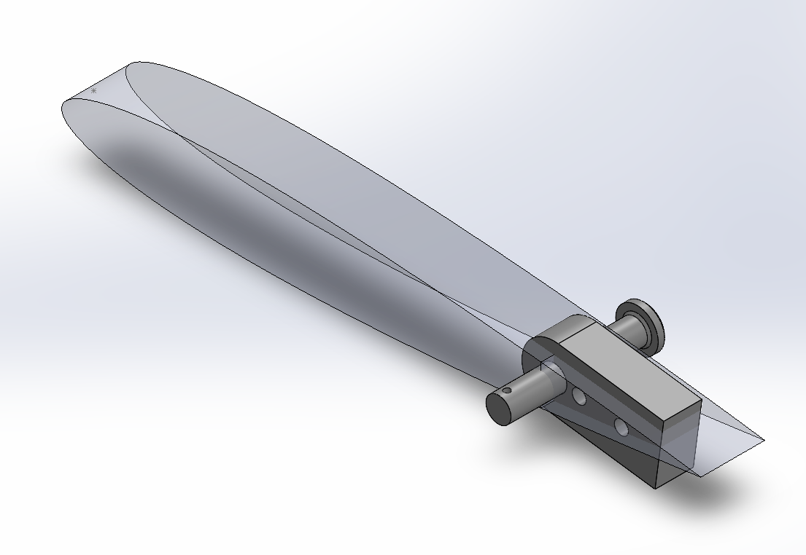
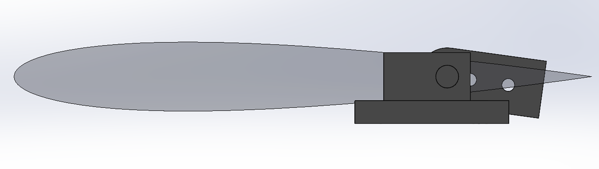
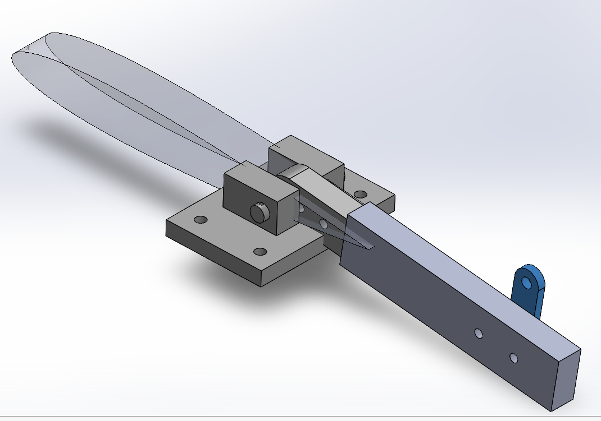
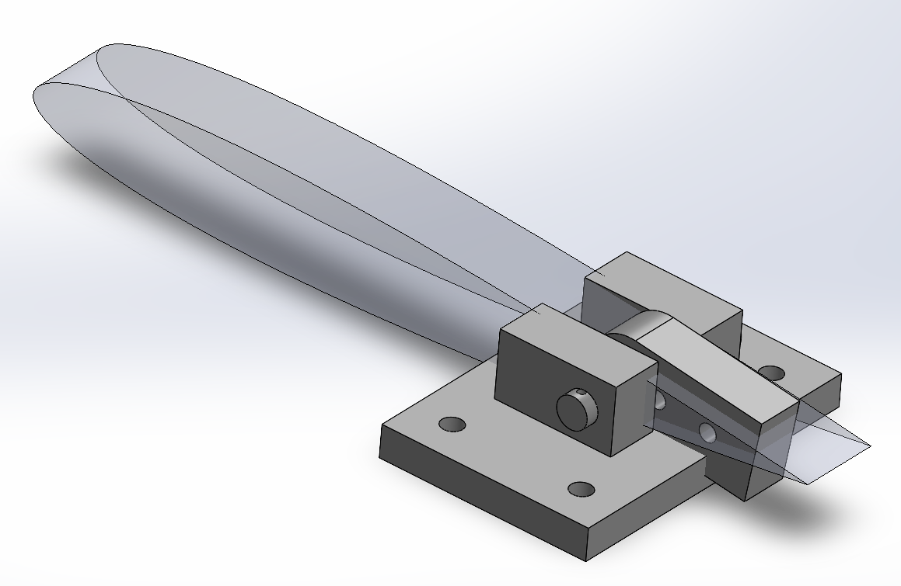
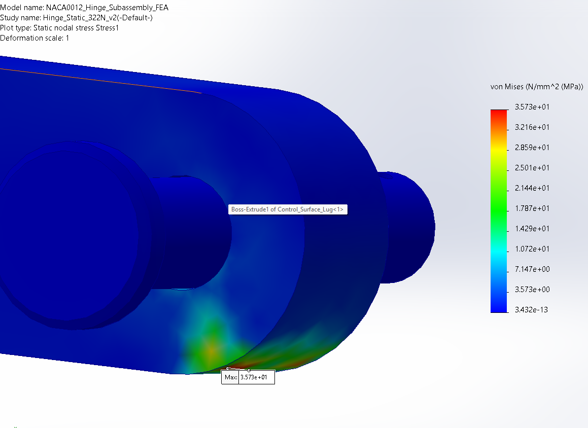
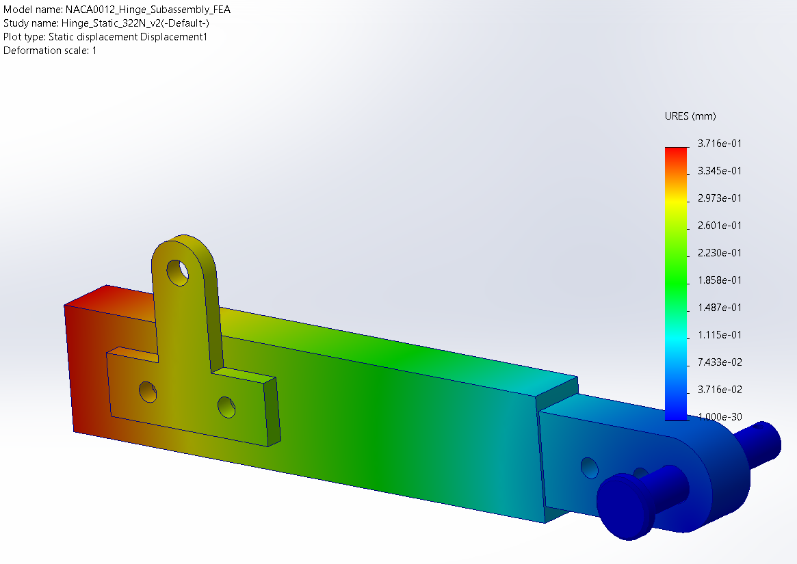
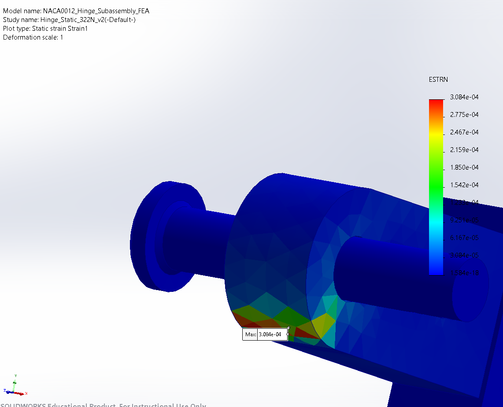
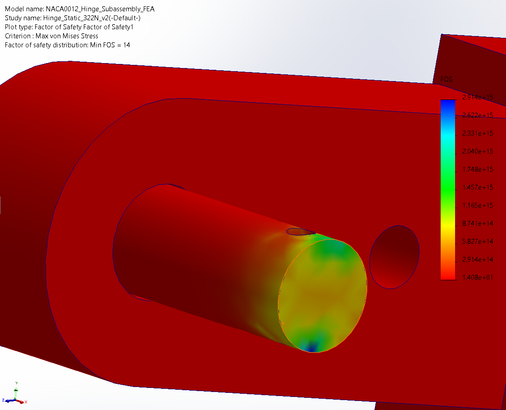
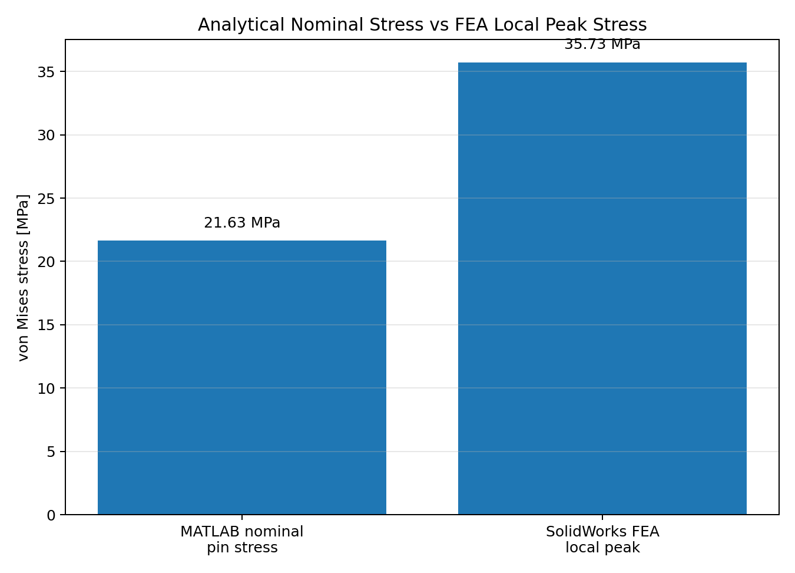
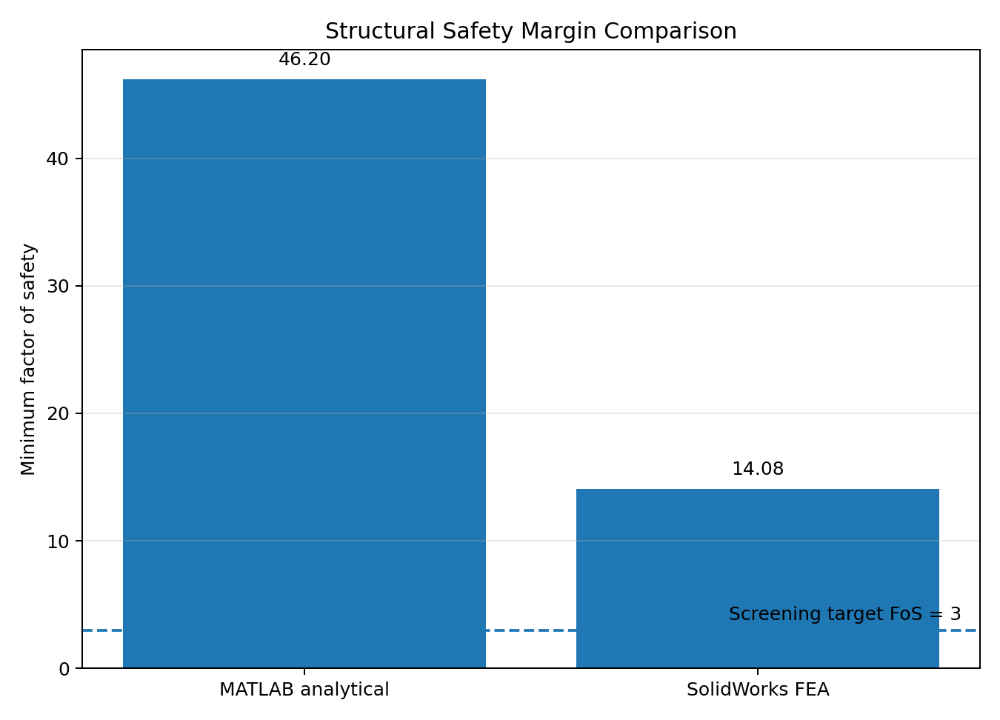

# NACA0012 Control-Surface Hinge Design & Structural Validation

**Aerospace mechanical-design portfolio project combining NACA0012 geometry, MATLAB load modelling and analytical sizing, SolidWorks CAD, and SolidWorks Simulation FEA.**

  

## Project objective

This project studies a representative aircraft control-surface hinge load path from the aerodynamic reference geometry through the mechanical hinge and into structural verification.

The central engineering question is:

> **Can a compact hinge mechanism sized using transparent analytical calculations safely transmit the screened control-surface load, and how closely does the analytical stress prediction agree with a local finite-element model?**

The project is intentionally built around a **public NACA0012 airfoil definition** and independent calculations rather than proprietary aircraft geometry. The detailed hinge hardware is a portfolio load-path demonstrator, not a copy of any manufacturer's internal hinge design.

---

## Why this project matters

Control-surface hinges are small components, but they sit directly in the force path between an aerodynamic surface and the supporting structure. Their design involves several linked disciplines:

- aerodynamic load estimation,
- hinge-moment calculation,
- pin and lug sizing,
- bearing and net-section checks,
- material selection,
- CAD packaging,
- contact definition,
- mesh refinement,
- finite-element stress interpretation,
- analytical-to-FEA correlation.

This project demonstrates that complete workflow rather than only producing a CAD model or a standalone simulation.

---

## System definition

| Parameter | Value |
|---|---:|
| Airfoil | NACA0012 |
| Main chord | **300 mm** |
| Hinge station | **225 mm from leading edge** |
| Hinge location | **x/c = 0.75** |
| Control-surface chord | **75 mm** |
| Control-surface span | **600 mm** |
| Control-surface area | **0.0450 m²** |
| Horn arm | **40 mm** |
| Pin diameter | **11.8 mm** |
| Lug hole diameter | **12.2 mm** |
| Lug thickness | **18 mm** |
| Bracket ear thickness | **25 mm each** |
| Aluminum components | **7075-T6** |
| Hinge pin | **17-4 PH stainless steel** |

  

The NACA0012 geometry is generated from the standard four-digit thickness equation and converted into a **201-point SolidWorks coordinate file**. The hinge station is placed at 75% chord, matching the control-surface definition used in the analytical model.

---

## Engineering workflow

### 1. NACA0012 geometry

The 300 mm NACA0012 profile was generated in MATLAB and imported into SolidWorks.

The 75%-chord hinge station is:

[
x_h = 0.75c = 225\text{ mm}
]

which leaves a control-surface chord of:

[
c_f = 75\text{ mm}
]

The coordinate set is available in:

[`NACA0012_300mm_xyz.txt`](NACA0012_300mm_xyz.txt)

---

### 2. Aerodynamic load screening

A lightweight analytical control-surface model was used to estimate the normal force and hinge moment over a velocity/deflection envelope.

Dynamic pressure:

[
q = \frac{1}{2}\rho V^2
]

Screening normal-force coefficient:

[
C_n = 2\pi\eta_\delta\delta
]

Control-surface force:

[
F = qSC_n
]

Hinge moment:

[
M_h = F(0.40c_f)
]

Horn force:

[
F_{horn}=\frac{M_h}{r_h}
]

At the maximum screened condition of **50 m/s and 25° deflection**:

| Quantity | Result |
|---|---:|
| Dynamic pressure | **1531.25 Pa** |
| Normal-force coefficient | **1.7820** |
| Control-surface force | **122.79 N** |
| Hinge moment | **3.684 N·m** |
| Horn force | **92.09 N** |
| Structural design reaction | **322.33 N** |

The structural reaction includes a **1.5 load factor**.

---

### 3. Analytical structural sizing

The hinge was screened analytically for:

- pin double shear,
- pin bending + shear interaction,
- lug bearing,
- lug net-section stress,
- bracket bearing,
- minimum factor of safety.

The representative nominal pin von Mises stress from the analytical model was:

**21.632 MPa**

with a minimum analytical factor of safety of:

**46.20**

This analytical solution provides the baseline against which the finite-element result is interpreted.

---

### 4. SolidWorks hinge mechanism

  

The structural subassembly contains the hinge bracket, hinge pin, lug, control-surface spar and horn structure.

The context assembly then places the hinge system at the same **225 mm / 75%-chord station** used in the aerodynamic model.

  

This is important because it establishes traceability between:

**airfoil geometry → hinge location → structural mechanism → applied design load**

---

## SolidWorks Simulation FEA

The final static study uses:

- **7075-T6 aluminum** for the aluminum components,
- **17-4 PH stainless steel** for the hinge pin,
- fixed support at the hinge-bracket/base attachment,
- roller/slider stabilization where required,
- local pin–lug contact,
- local pin–bracket contact,
- solid finite elements,
- local refinement in the hinge/contact region,
- applied structural reaction of **322.33 N**.

### von Mises stress

  

**Local peak von Mises stress: 35.73 MPa**

The peak appears near the local load-transfer/contact region rather than in the nominal far-field section, which is consistent with the expected stress concentration around the hinge interface.

### Displacement

  

**Maximum resultant displacement: 0.3716 mm**

### Equivalent strain

  

**Maximum equivalent strain: 3.084 × 10⁻⁴**

### Factor of safety

  

**Minimum reported FEA factor of safety: 14.08**

The project screening target was **FoS = 3.0**.

Very large FoS values in nearly unstressed regions are not treated as meaningful design metrics; the relevant quantity is the **minimum** value.

---

## Analytical vs FEA correlation

| Method | Representative von Mises stress | Minimum FoS |
|---|---:|---:|
| MATLAB analytical model | **21.632 MPa** | **46.20** |
| SolidWorks FEA | **35.730 MPa** | **14.08** |

The stress ratio is:

[
\frac{\sigma_{FEA}}{\sigma_{analytical}}
=\frac{35.730}{21.632}
\approx 1.65
]

  

  

The FEA peak is approximately **1.65× the analytical nominal stress**.

That difference is not interpreted as a failed correlation. The two models represent different levels of fidelity:

- the MATLAB model treats the pin and load path using idealized beam/shear relationships,
- the FEA model resolves local geometry, contact, bearing and stress concentration.

The comparison therefore shows how a simple analytical model can provide first-pass sizing while FEA identifies the local effects omitted by the nominal calculation.

---

## Key results

| Metric | Result |
|---|---:|
| Design hinge reaction | **322.33 N** |
| MATLAB nominal pin von Mises stress | **21.632 MPa** |
| SolidWorks FEA local peak von Mises stress | **35.730 MPa** |
| FEA / analytical stress ratio | **1.65×** |
| MATLAB minimum FoS | **46.20** |
| SolidWorks FEA minimum FoS | **14.08** |
| Screening target FoS | **3.00** |
| Maximum FEA displacement | **0.3716 mm** |
| Maximum equivalent strain | **3.084 × 10⁻⁴** |

---

## MATLAB files

| File | Purpose |
|---|---|
| [`01_hinge_load_model.m`](01_hinge_load_model.m) | Velocity/deflection load screening |
| [`02_structural_sizing.m`](02_structural_sizing.m) | Analytical pin, lug and bracket checks |
| [`03_fea_comparison.m`](03_fea_comparison.m) | MATLAB vs SolidWorks result comparison |
| [`04_naca0012_coordinates.m`](04_naca0012_coordinates.m) | NACA0012 coordinate generation |

---

## Documentation

For more detail:

- [Methodology](methodology.md)
- [Results](results.md)
- [Limitations and claim boundaries](limitations.md)
- [Aerodynamic / SU2 notes](SU2_NOTES.md)
- [NACA0012 SolidWorks coordinate file](NACA0012_300mm_xyz.txt)

---

## Tools and engineering skills demonstrated

**CAD / Mechanical Design**
- SolidWorks part modelling
- assembly design
- mechanical interfaces
- hinge/pin/lug geometry
- design for load transfer
- reference geometry integration

**Structural Engineering**
- analytical stress calculations
- bearing and net-section checks
- pin bending and double shear
- factor-of-safety assessment
- contact modelling
- FEA interpretation

**Engineering Computing**
- MATLAB
- parametric load screening
- numerical coordinate generation
- analytical/FEA correlation
- engineering data visualization

**Aerodynamics**
- NACA0012 reference geometry
- dynamic-pressure scaling
- control-surface force estimation
- hinge-moment estimation
- lightweight SU2 workflow context

---

## Project limitations

This is a **portfolio-level engineering study**, not aircraft certification evidence or flight-hardware substantiation.

The current model does not include:

- fatigue/spectrum loading,
- full aircraft/control-surface flexibility,
- detailed fastener preload,
- manufacturing-tolerance sensitivity,
- nonlinear material response,
- certification load cases,
- full aeroelastic coupling,
- a documented mesh-convergence study.

The hinge mechanism is used as a **representative structural load-path demonstrator** and is not claimed to be a packaging-optimized internal installation inside a real NACA0012 wing.

See [`limitations.md`](limitations.md) for the complete scope statement.

---

## Aerodynamic / SU2 note

A lightweight 2-D SU2 check was used during the project workflow. The exact original SU2 configuration, mesh and coefficient-history files were not available in the final publishing workspace, so **no solver files or aerodynamic coefficients have been fabricated for this repository**.

This keeps the repository reproducible and technically honest: only files and results that are actually available are published.

---

## Reference basis

The project uses public/non-proprietary reference material:

- E. N. Jacobs, K. E. Ward, R. M. Pinkerton, *The Characteristics of 78 Related Airfoil Sections from Tests in the Variable-Density Wind Tunnel*, **NACA Report 460**, 1933.
- SU2 documentation — NACA0012 2-D quick-start/reference workflow.

---

## Repository purpose

This repository is part of an engineering portfolio focused on **aerospace mechanical design, control-surface mechanisms, structural analysis, finite-element analysis, MATLAB engineering workflows, and CAD-to-analysis validation**.

If you are reviewing this project as an engineer or recruiter, the most useful starting points are:

1. the **CAD context images** above,
2. the **analytical vs FEA comparison**,
3. [`methodology.md`](methodology.md),
4. [`results.md`](results.md),
5. the four MATLAB scripts.

